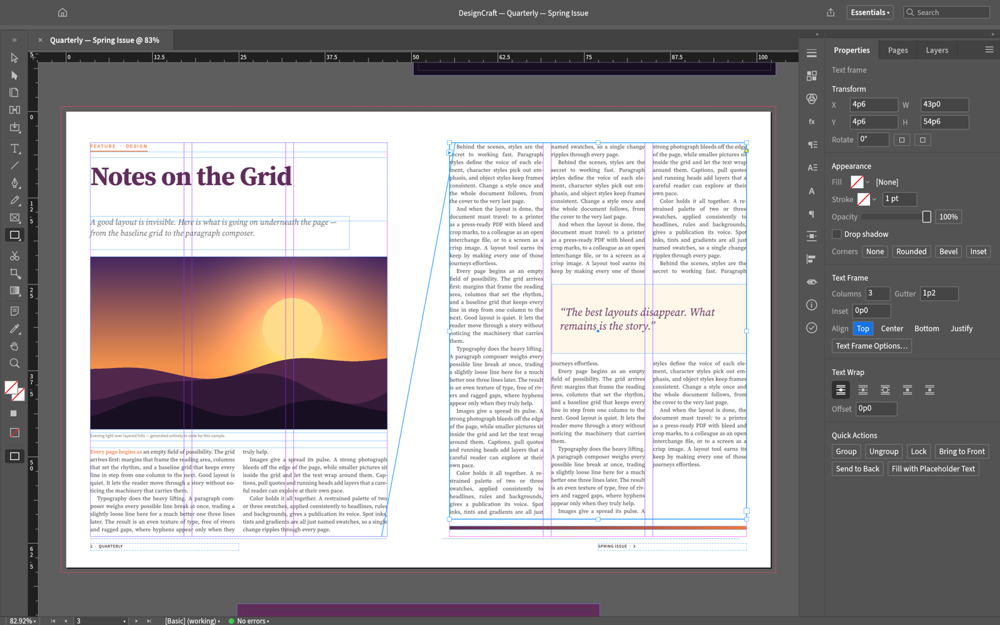
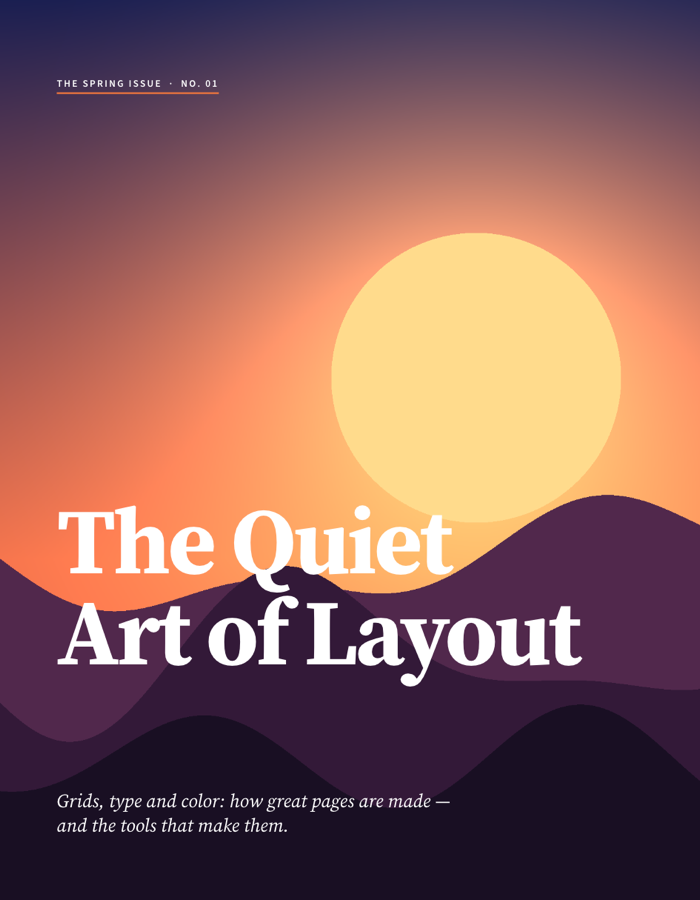
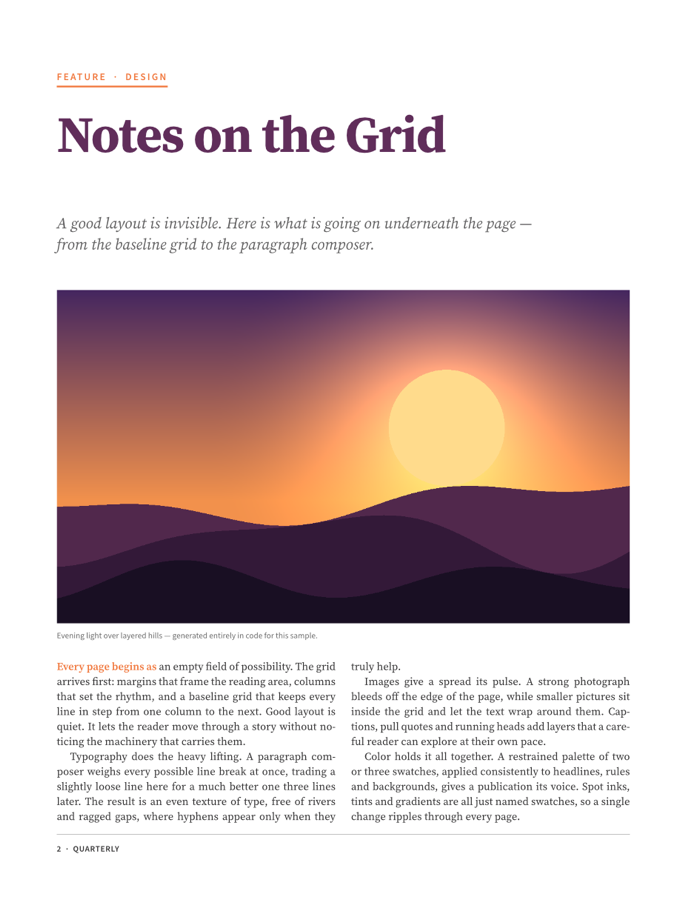
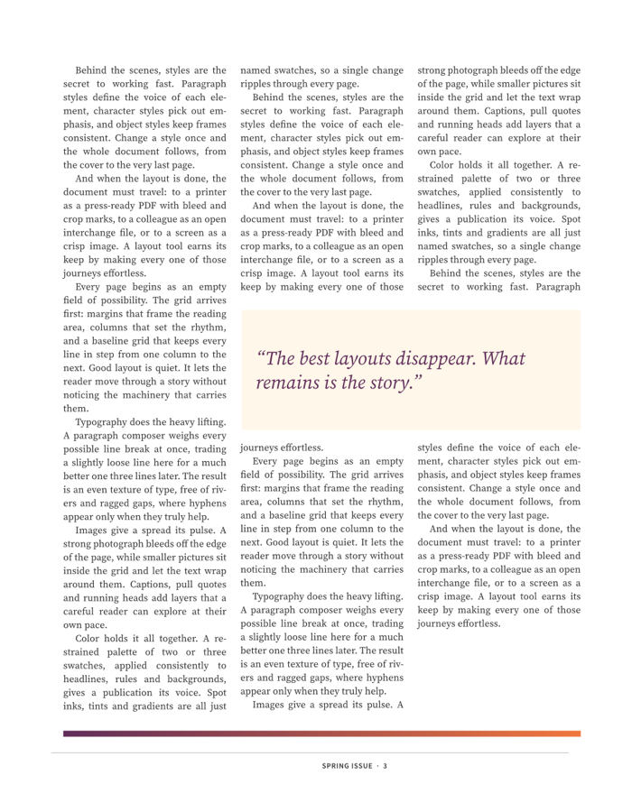

<h1 align="center">DesignCraft</h1>

<p align="center">
  <b>Page layout and publishing, rebuilt in pure Rust.</b><br>
  A fast, open-source, clean-room take on the Adobe InDesign workflow — native on macOS, Windows and Linux, and in the browser via WebAssembly.<br>
  <i>By the ArtCraft team.</i>
</p>

<p align="center">
  
  <br><sub><b>Quarterly — Spring Issue</b>: threaded three-column body text, a wrapped pull quote, parent-page folios, all set by DesignCraft's own paragraph composer.</sub>
</p>

<table>
<tr>
<td width="33%" valign="top"><p align="center"><sub>Cover: full-bleed graphic frame, display type</sub></p></td>
<td width="33%" valign="top"><p align="center"><sub>Styles: kicker rule, headline, deck, justified body</sub></p></td>
<td width="33%" valign="top"><p align="center"><sub>Threading, columns and text wrap</sub></p></td>
</tr>
</table>

Every page above was laid out by DesignCraft from code (`crates/engine/src/sample.rs`) and exported by its own renderer — try it with `File → New → Sample Document` or `--sample`.

### Why DesignCraft

- **Familiar.** InDesign's layout, tools, menus, panels and shortcuts: spreads and parent pages, frames and threaded stories, the Control panel, paragraph and character styles, swatches, text wrap… you already know how to use it.
- **Beautiful type.** A Knuth–Plass paragraph composer (plus single-line), dictionary hyphenation (public-domain Moby word list + our own trained patterns), word/letter/glyph-scaling justification, keeps, optical margin alignment, columns, baseline grid, tabs, rules and shading — identical line breaks on screen and in PDF.
- **Fast.** Multithreaded SIMD rendering (vello_cpu), copy-on-write documents with O(1) undo snapshots, cached composition.
- **Open.** A documented native format, IDML import/export, PNG export, and PDF on the roadmap — no subscription, no licence server, no telemetry.
- **Agent-native.** Every menu item, tool gesture, panel control and dialog is drivable over a JSON control channel and an **MCP server**, so Claude and other agents can lay out and edit documents like a designer.
- **Everywhere.** One Rust codebase for desktop and the web.

## Quick start

```sh
cargo run --release -p designcraft                         # desktop app (start screen)
cargo run --release -p designcraft -- --sample             # open the sample magazine
cargo run --release -p designcraft -- --sample --control 7979   # + JSON control channel
cargo run --release -p designcraft-cli -- run --sample --all-pages out/       # headless: render every page to PNG
cargo run --release -p designcraft-cli -- commands         # list every command
cargo xtask ci                                             # fmt, clippy, tests, assets, layering, wasm
```

Drive a running app: send JSON lines to `127.0.0.1:7979` — see [`docs/control-protocol.md`](docs/control-protocol.md).

### Web

```sh
cd apps/designcraft-web && trunk build --release          # → dist/web (serve it with any static server)
cd apps/designcraft-web && trunk serve --release          # http://127.0.0.1:8767
```

Needs [trunk](https://trunkrs.dev) and the `wasm32-unknown-unknown` target. The same app runs through eframe's web runner on WebGPU, falling back to WebGL2 (`?webgl` forces it; `?sample` opens the sample magazine). Open and Place use the browser's file picker (dropping files works too); Save and Export download the file. The web build has no control channel.

## Architecture

An engine-first Cargo workspace with enforced layering (`cargo xtask layers`); the egui frontend is a separate crate, so the UI can be swapped without touching the engine.

| Layer | Crates |
|---|---|
| L0 | `geom` (paths, units & measurement parsing, corner options) · `color` (CMYK/RGB/Lab, swatches, tints, gradients) |
| L1 | `doc` (spreads, pages, parents, layers, frames, stories, styles) · `fonts` (font DB, shaping, outlines) |
| L2 | `compose` (the text engine) |
| L3 | `render` (vello_cpu) |
| L4 | `tools` (pointer events → commands + overlays) |
| L5 | `engine` (session, history, command registry) |
| L6 | `ui-egui` (InDesign-style UI, control channel) |
| L7 | `apps/designcraft`, `apps/designcraft-cli`, `apps/designcraft-web` |

Status and milestones: **[ROADMAP.md](ROADMAP.md)**. Contributor and agent rules (clean-room, asset policy, quality gates): [`AGENTS.md`](AGENTS.md). Every bundled asset is listed with its licence in [`ASSETS.md`](ASSETS.md).

## Crafting Apps

Open-source, pure-Rust, clean-room creative tools — each engine-first, cross-platform, WASM-ready and fully agent-drivable.

<table>
<tr>
  <td align="center" width="20%"><a href="https://github.com/storytold/photocraft"><b>PhotoCraft</b></a></td>
  <td>Layered raster image editor in the spirit of <b>Photoshop</b> — high-bit-depth pipeline, adjustment layers, brushes, PSD round-trip.</td>
</tr>
<tr>
  <td align="center"><a href="https://github.com/storytold/drawcraft"><b>DrawCraft</b></a></td>
  <td>Vector illustration in the spirit of <b>Illustrator</b> — Pen, Pathfinder, live effects, type, SVG/PDF.</td>
</tr>
<tr>
  <td align="center"><a href="https://github.com/storytold/designcraft"><b>DesignCraft</b></a></td>
  <td>Page layout in the spirit of <b>InDesign</b> — spreads, threaded stories, styles, a Knuth–Plass composer. <i>(you are here)</i></td>
</tr>
<tr>
  <td align="center"><a href="https://github.com/storytold/filmcraft"><b>FilmCraft</b></a></td>
  <td>Non-linear video editor in the spirit of <b>Premiere Pro</b> — timeline editing, effects, and export.</td>
</tr>
<tr>
  <td align="center"><a href="https://github.com/storytold/lightcraft"><b>LightCraft</b></a></td>
  <td>Photo library and non-destructive raw developer in the spirit of <b>Lightroom</b> — local-first catalog, wide-gamut float pipeline.</td>
</tr>
<tr>
  <td align="center"><a href="https://github.com/storytold/printcraft"><b>PrintCraft</b></a></td>
  <td>PDF viewer and editor in the spirit of <b>Acrobat</b> — rendering, forms, annotations, and document tools.</td>
</tr>
</table>

## License

MIT OR Apache-2.0. Bundled fonts are OFL; all icons are drawn in code and are original. Per-asset attribution: [`ASSETS.md`](ASSETS.md) (see also [`NOTICE`](NOTICE)).

<sub>DesignCraft is an independent project and is not affiliated with or endorsed by Adobe. "Adobe", "InDesign", "Illustrator", "Photoshop", "Premiere Pro", "Lightroom" and "Acrobat" are trademarks of Adobe Inc., used here only to describe compatibility and workflow familiarity.</sub>
